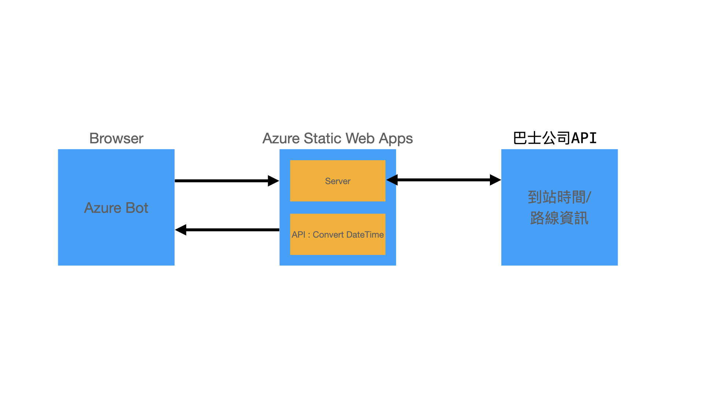

# Azure Static Web Apps遇上Azure Bot，快速部署巴士到站時間Chatbot

## 巴士到站時間Chatbot
搭巴士都是大家日常，看巴士到站時間已經是日常習慣。唔知大家有無遇過。。。報站系統顯示器太遠，或者位置被遮住看唔到；但是看手機又要花時間找。所以設計一個Chatbot訪問巴士公司巴士到站時間。當然，Chatbot都要部署上Azure先可以是街上使用，所以Azure Static Web Apps被用作放置Azure Bot。最後，再部署Azure Static Web Apps上Azure。

## 設計
Chatbot完整設計如下：

透過Bot Framework Composer可以用即見即所得（What You See Is What You Get）介面快速設計Chatbot。最後透過部署上Azure取得Web Chat 介面 HTML code再放入Web Page上Server（Azure Static Web Apps）。

設計Chatbot之前，就要開始準備設計Azure Static Web Apps。Azure Static Web Apps需要提供三個功能，訪問巴士公司取得路線資訊及到站時間；轉換時間成指定格式；儲放Web Page。

訪問巴士公司取得路線資訊及到站時間，它是一個GraphQL Server。因為它不是今日題目既討論範圍，所以請參考本blog source code。

轉換時間成指定格式，因為到站時間是W3C格式，所以Azure Static Web Apps需要提供API轉換成指定格式方便用家閱讀。它正好被示範如何使用Azure Static Web Apps。

儲放Web Page，利用Azure Static Web Apps本身已提供既Web Page顯示Web Chat介面。

## 設計Azure Static Web Apps
### 安裝 VS Code Extension：Azure Static Web Apps

## 部署Azure Static Web Apps

## 設計Chatbot

## 部署Chatbot

## 測試

## 參考